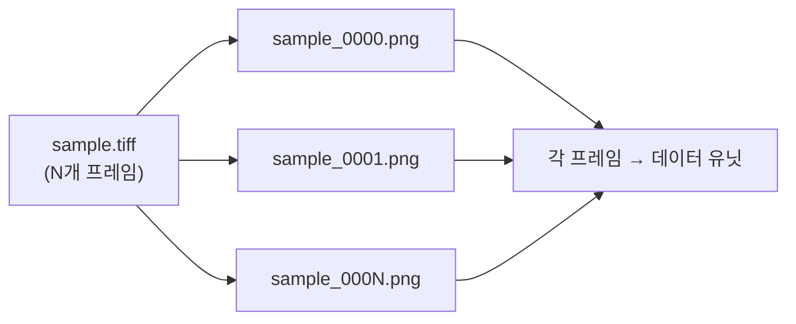
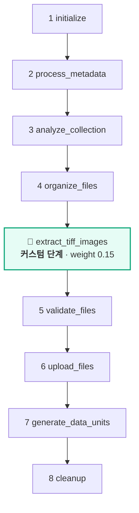
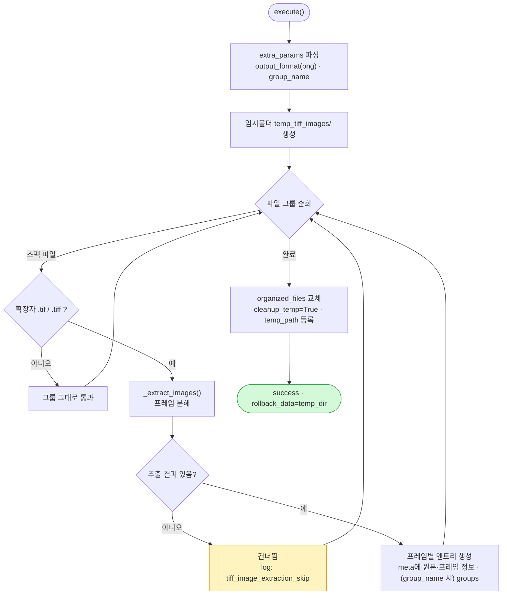
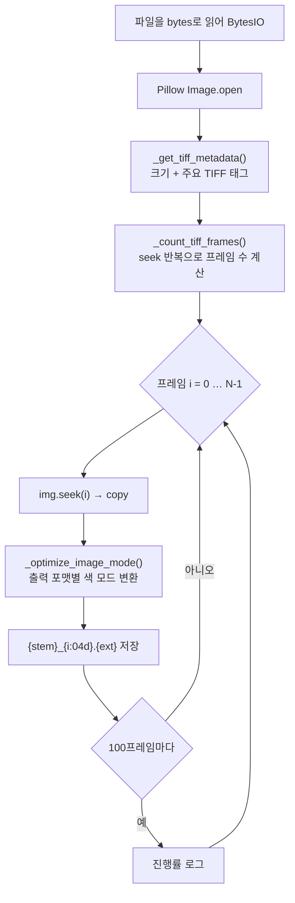

# tiff-to-image-uploader

멀티프레임 **TIF/TIFF** 파일을 프레임 단위 이미지(PNG/JPG)로 추출하여 각각을 데이터 유닛으로 업로드하는 업로드 플러그인.

---

## 1. 플러그인 식별 정보

| 항목 | 값 |
| --- | --- |
| 폴더명 / GitHub 저장소 | `extract-image-from-tiff` |
| 코드명 (`config.yaml` → `code`) | `extract-image-from-tiff` |
| 플러그인 이름 (`config.yaml` → `name`) | `tiff-to-image-uploader` |
| 패키지명 (`pyproject.toml` → `name`) | `tiff-to-image-uploader` |
| 버전 | `2.1.0` |
| 카테고리 | `upload` |
| 지원 데이터 타입 | `image` |
| upload 진입점 | `plugin.upload.UploadAction` |

---

## 2. 개요

TIFF는 한 파일에 여러 프레임(페이지)을 담을 수 있습니다. 이 플러그인은 업로드 직전에 **각 프레임을 개별 이미지 파일로 분해**하여 프레임 1장 = 데이터 유닛 1개로 업로드합니다. TIFF가 아닌 파일은 변환 없이 통과합니다. 이미지 처리는 **Pillow**를 사용합니다.



### 입/출력 스펙

| 구분 | 내용 |
| --- | --- |
| 대상 확장자 | `.tif`, `.tiff` |
| 출력 형식 | `png`(기본) 또는 `jpg` |
| 프레임 파일명 | `{원본stem}_{프레임번호:04d}.{ext}` |
| 색 모드 최적화 | JPG→RGB / PNG→투명도 있으면 RGBA·없으면 RGB |

---

## 3. 파라미터 (UI 스키마)

| 이름 | 형태 | 설명 | 기본값 |
| --- | --- | --- | --- |
| `output_format` | select | 출력 이미지 형식 (`png` / `jpg`) | `png` |
| `group_name` | text | 데이터 유닛에 부여할 묶음 이름 | (없음) |

---

## 4. 전체 업로드 워크플로우

`organize_files` **직후**에 `ExtractTiffImagesStep`(weight 0.15)을 삽입합니다.



---

## 5. `ExtractTiffImagesStep` 상세 로직

**스킵 판정**: `organized_files`에 TIFF 파일이 하나도 없으면 단계 스킵.



### 프레임 분해 (`_extract_images`)



- 추출되는 주요 TIFF 태그: `BitsPerSample`, `Compression`, `PhotometricInterpretation`, `XResolution`/`YResolution`, `ResolutionUnit`, `Software`, `DateTime`.
- 개별 프레임 저장 실패 시 해당 프레임만 건너뜀(`continue`).
- **롤백**: 임시 디렉터리(`temp_tiff_images`) 삭제.

---

## 6. 생성되는 메타데이터 (프레임별)

| 키 | 설명 |
| --- | --- |
| `origin_file_name` / `origin_file_format` / `origin_tiff_path` | 원본 TIFF 정보 |
| `image_width` / `image_height` | 프레임 크기 |
| (위 TIFF 태그들) | `bits_per_sample`, `compression`, … |
| `frame_count` / `frame_index` | 총 프레임 수 / 현재 프레임(1부터) |
| `output_format` | 출력 형식 |
| `groups` | `group_name` 지정 시 (선택) |

---

## 7. 의존성

- `synapse-sdk`
- `Pillow`

---

## 8. 설치 / 실행 / 배포

```bash
uv sync
synapse run upload
synapse plugin publish
```
